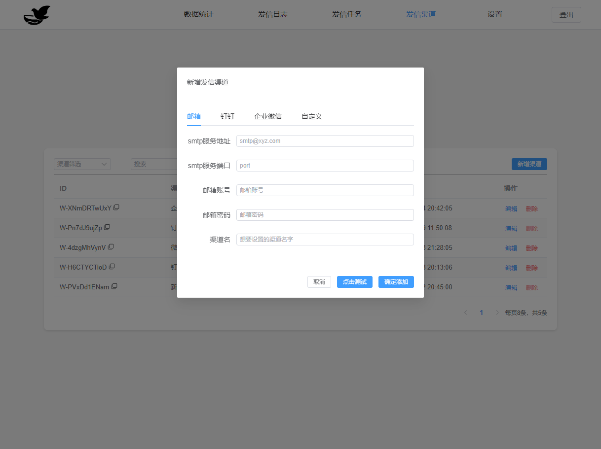
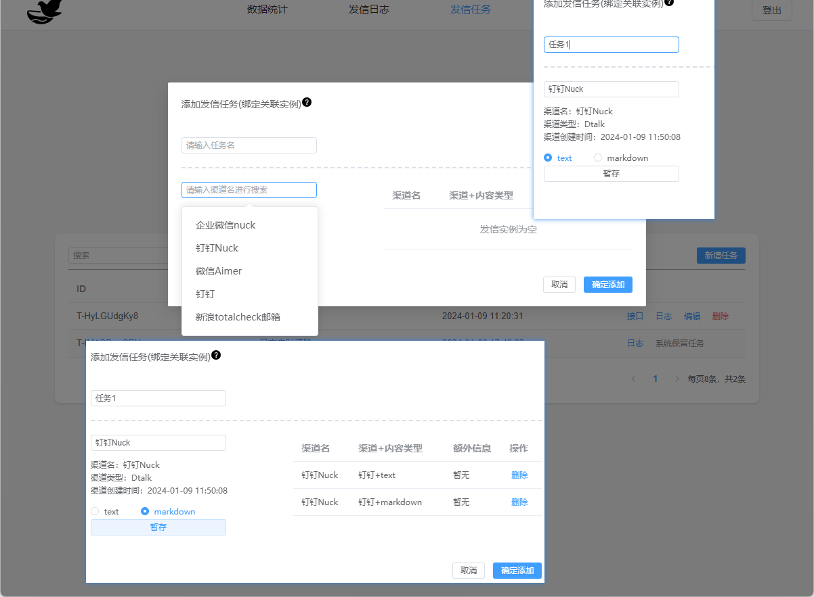
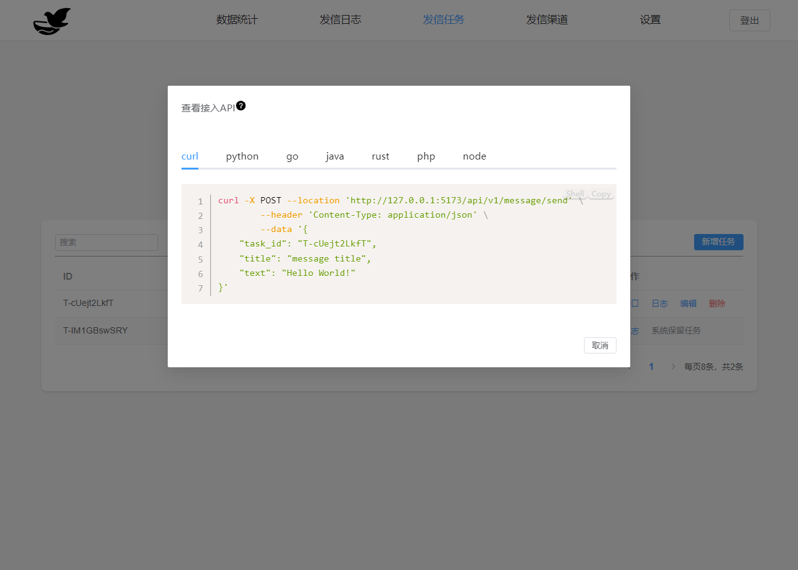

# Message Nest 🕊️

Message Nest 是一个灵活而强大的消息推送整合平台，旨在简化并自定义多种消息通知方式。

项目名叫信息巢，意思是一个拥有各种渠道信息方式的集合站点。

如果你有很多消息推送方式，每次都需要调用各种接口去发送消息到各个渠道，或者不同的项目你都需要复制同样的发消息代码，这个项目可以帮你管理各种消息方式，并提供统一的发送api接入。你可以自由组合各种消息渠道，一个api推送到各种渠道，帮你省去接入的繁琐步骤。

演示站点(演示站点的服务器比较烂，见谅) [demo](https://message-nest-demo-site.qwapi.eu.org/)

## 特色 ✨

- 🔄 **整合性：** 提供了多种消息推送方式，包括邮件、钉钉、企业微信等，方便你集中管理和定制通知。
- 🎨 **自定义性：** 可以根据需求定制消息推送策略，满足不同场景的个性化需求。
- 🛠 **开放性：** 易于扩展和集成新的消息通知服务，以适应未来的变化。

## 进度 🔨

项目还在不断更新中，欢迎大家提出各种建议。

关于日志，考虑到目前多数服务以收集控制台输出为主，暂时不支持写出日志文件。

## 功能更新日志

- **2024.04.29**
    - 支持 SQLite 部署
    - 支持MySQL 5.x  8.x
- **2024.04.11**
    - 支持自定义的定时消息发送
- **2024.03.05**
    - 支持微信测试公众号模板消息发送
- **2024.01.28**
    - 支持 Docker 部署，从环境变量启动服务
- **2024.01.24**
    - 支持数据统计展示
- **2024.01.20**
    - 添加日志查看自动刷新
- **2024.01.07**
    - 支持站点信息自定义
- **2024.01.03**
    - 支持企业微信
    - 单应用打包，直接运行，无需部署前端页面
    - 支持邮件发送
    - 用户密码设置
    - 支持用户定时任务清理，更新定时时间
    - 查看定时清理日志
    - 单应用的 HTML 浏览器自动缓存
    - Gin 的日志使用 Logrus
    - 支持异步发送
    - 支持邮件发送
    - 支持钉钉
    - 支持自定义的 Webhook 消息发送
    - 企业微信支持
  
## 项目来由 💡

自己常常写一些脚本需要消息推送，经常需要接入不同的消息发送，很不方便，于是就有了这个项目。

## 效果图 📺


## 使用方法 🚀

<details>
  <summary>1. 直接运行最新的release打包的可执行文件（推荐，不用部署前端页面🍀🍀）</summary>

1. 下载最新的系统版本对应的release， 解压
2. 新建一个数据库
3. 重命名conf/app.example.ini为conf/app.ini
4. 修改app.ini对应的配置
5. 将配置中`EmbedHtml = disable`, 进行注释，以单应用方式运行，完整配置参考如下：

```ini
[app]
JwtSecret = message-nest
LogLevel = INFO

[server]
RunMode = release
HttpPort = 8000
ReadTimeout = 60
WriteTimeout = 60
; 注释EmbedHtml，启用单应用模式
; EmbedHtml = disable

[database]
; 关闭SQL打印
; SqlDebug = enable

; Type = sqlite
Type = mysql
User = root
Password = Aa123456
Host = vm.server
Port = 3308
Name = yourDbName
TablePrefix = message_

```

6. 启动项目会自动创建表和账号

```shell
# INFO日志级别启动回出现如下日志

[2024-01-13 13:40:09.075]  INFO [migrate.go:70 Setup] [Init Data]: Migrate table: message_auth
[2024-01-13 13:40:11.778]  INFO [migrate.go:70 Setup] [Init Data]: Migrate table: message_send_tasks
[2024-01-13 13:40:16.518]  INFO [migrate.go:70 Setup] [Init Data]: Migrate table: message_send_ways
[2024-01-13 13:40:23.300]  INFO [migrate.go:70 Setup] [Init Data]: Migrate table: message_send_tasks_logs
[2024-01-13 13:40:28.715]  INFO [migrate.go:70 Setup] [Init Data]: Migrate table: message_send_tasks_ins
[2024-01-13 13:40:39.538]  INFO [migrate.go:70 Setup] [Init Data]: Migrate table: message_settings
[2024-01-13 13:40:46.299]  INFO [migrate.go:74 Setup] [Init Data]: Init Account data...
[2024-01-13 13:40:46.751]  INFO [migrate.go:77 Setup] [Init Data]: All table data init done.

```

7. 启动项目，访问8000端口，初始账号为admin，密码为123456

</details>


<details>
  <summary>2. 前后端分离部署（待更新）</summary>
</details>


[//]: # (1. 前端项目构建)

[//]: # (```shell)

[//]: # (cd web && npm i && npm run build)

[//]: # (```)

[//]: # (2. 配置配置文件，参考上面，需要注意将配置中`EmbedHtml = disable`取消注释)

[//]: # (3. 启动go服务)

[//]: # (```shell)

[//]: # (go mod tidy)

[//]: # (CGO_ENABLED=0 go build -o Message-Nest)

[//]: # (./Message-Nest)

[//]: # (```)

[//]: # (4. 配置Nginx，将静态文件)

[//]: # (5. 配置Nginx，将后端接口转发)

<details>
  <summary> 3. 开发调试运行</summary>

1. 重命名conf/app.example.ini为conf/app.ini， 关键配置如下

```ini
[app]
JwtSecret = message-nest
LogLevel = INFO

[server]
; RunMode务必设置成debug，会自动添加跨域
RunMode = debug
HttpPort = 8000
ReadTimeout = 60
WriteTimeout = 60
; 取消EmbedHtml的注释（启用前后端分离），然后到web目录下面，npm run dev启动前端页面
EmbedHtml = disable

[database]
; 开启SQL打印
SqlDebug = enable

; Type = sqlite
Type = mysql
User = root
Password = Aa123456
Host = vm.server
Port = 3308
Name = yourDbName
TablePrefix = message_

```

2. 运行main.go，服务启动后会运行在8000端口

```shell
go mod tidy
go run main.go
```

3. 启动前端页面，页面启动后会提示访问url，一般是`http://127.0.0.1:5173`

```shell
cd web
npm i
npm run dev
```

4. 访问`http://127.0.0.1:5173`，进行调试开发，接口会自动转发到go服务`http://localhost:8000`

</details>

<details>
  <summary>4. docker/docker-compose部署（推荐指数🍀🍀🍀🍀🍀）</summary>

<details>
  <summary>docker挂载app.ini部署</summary>

1. 新建一个数据库，准备一个conf文件夹
2. 新增conf/app.ini
3. 修改app.ini对应的配置
4. 将配置中`EmbedHtml = disable`, 进行注释，以单应用方式运行，完整配置参考如下：

```ini
[app]
JwtSecret = message-nest
LogLevel = INFO

[server]
RunMode = release
; docker模式下端口配置文件中只能为8000
HttpPort = 8000
ReadTimeout = 60
WriteTimeout = 60
; 注释EmbedHtml，启用单应用模式
; EmbedHtml = disable

[database]
; 关闭SQL打印
; SqlDebug = enable

; Type = sqlite
Type = mysql
User = root
Password = Aa123456
Host = vm.server
Port = 3308
Name = yourDbName
TablePrefix = message_

```

6. 使用命令启动，端口使用`-p`自定义

```shell
docker pull engigu/message-nest:latest
# 测试运行
docker run --rm -ti \
  -p 8000:8000 \
  -v /your/path/conf:/app/conf \
  engigu/message-nest:latest 
  
# 正式运行
docker run -d \
  -p 8000:8000 \
  -v /your/path/conf:/app/conf \
  engigu/message-nest:latest 
```

7. 启动项目，访问8000端口，初始账号为admin，密码为123456

</details>

<details>
  <summary>docker-compose挂载app.ini部署</summary>

1. 准备app.ini，文件内容如上docker部署
2. 准备docker-compose.yml，内容如下：

```yml
version: "3.7"
services:

  message-nest:
    image: engigu/message-nest:latest
    container_name: message-nest
    restart: always
    volumes:
      - ./conf:/app/conf
    ports:
      - "8000:8000"
```

3. 文件目录结构

```shell
.
├── conf
│   └── app.ini
├── docker-compose.yml

```

4. 启动项目

```shell
# 测试运行
docker-compose up
# 正式运行
docker-compose up -d
```

</details>

<details>
  <summary>docker/docker-compose环境变量部署（推荐指数🍀🍀🍀🍀🍀🍀🍀🍀🍀）</summary>

环境变量介绍

| 变量                 | 说明                                                 | 
|--------------------|----------------------------------------------------|
| JWT_SECRET         | jwt秘钥，可选，默认为message-nest                           |
| LOG_LEVEL          | 日志等级，可选，默认为INFO，DEBUG/INFO/ERROR                   |
| RUN_MODE           | 运行模式，可选，默认release，为debug将自动添加跨域                    |
|                    |                                                    |
| DB_TYPE            | 数据库类型，sqlite/mysql。默认为sqlite,存储路径为conf/database.db |
|                    |                                                    |
| MYSQL_HOST         | mysql-host，DB_TYPE=mysql必填                         |
| MYSQL_PORT         | mysql端口，DB_TYPE=mysql必填                            |
| MYSQL_USER         | mysql用户名，DB_TYPE=mysql必填                           |
| MYSQL_PASSWORD     | mysql数据库密码，DB_TYPE=mysql必填                         |
| MYSQL_DB           | mysql数据库名字，DB_TYPE=mysql必填                         |
| MYSQL_TABLE_PREFIX | mysql数据表前缀，DB_TYPE=mysql必填                         |
|                    |                                                    |
| SQL_DEBUG          | 是否打印SQL，可选，默认关，设置enable为开启                         |

docker运行

```shell

# 正式运行（mysql）
docker run -d  \
  -p 8000:8000 \
  -e MYSQL_HOST=192.168.64.133  \
  -e MYSQL_PORT=3308 \
  -e MYSQL_USER=root \
  -e MYSQL_PASSWORD=Aa123456 \
  -e MYSQL_DB=test_11 \
  -e MYSQL_TABLE_PREFIX=message_ \
  --name message-nest  \
  engigu/message-nest:latest 

# 正式运行（sqlite）
docker run -d  \
  -p 8000:8000 \
  -v you/path/database.db=conf/database.db  \
  --name message-nest  \
  engigu/message-nest:latest 
```

docker-compose运行(mysql)

```yml
version: "3.7"
services:

  message-nest:
    image: engigu/message-nest:latest
    container_name: message-nest
    restart: always
    ports:
      - "8000:8000"
    environment:
      - MYSQL_HOST=192.168.64.133
      - MYSQL_PORT=3308
      - MYSQL_USER=root
      - MYSQL_PASSWORD=Aa123456
      - MYSQL_DB=test_11
      - MYSQL_TABLE_PREFIX=message_
```

docker-compose运行(sqlite)

```yml
version: "3.7"
services:

  message-nest:
    image: engigu/message-nest:latest
    container_name: message-nest
    restart: always
    ports:
      - "8000:8000"
    volumes:
      - you/path/database.db:conf/database.db
```

```shell
# 正式运行
docker-compose -up -d
```

</details>

</details>

#### 关于EmbedHtml配置的说明

> 这个配置可以理解为单应用模式（或者前后端分离）的开关
>  1. 打开这个配置，表示前后端分离，表示go服务启动的时候只会有api服务，需要到web目录下，npm run
      dev启动前端项目。然后访问前端项目提示的端口服务，一般是127.0.0.1:5173。
      或者使用npm run build，用Nginx部署前端。
>
>  2. 注释这个配置，表示单应用，启动go服务，会把web/dist目录下文件作为前端静态资源。
     如果目录下没有静态资源文件，需要到web目录下，npm run build构建生成。
>
> 两种方式各有优缺点，综合考虑下来，推荐直接使用release的打包执行文件（或者docker环境变量进行部署），其中已经内置了页面静态资源，只用运行一个服务。

## 完整配置说明 ⚙️

<details>
  <summary>点击展开</summary>

```ini
[app]
JwtSecret = message-nest
; 暂时无用
RuntimeRootPath = runtime/
LogLevel = INFO

[server]
; debug or release
; debug模式下会自动添加跨域headers
RunMode = release
HttpPort = 8000
ReadTimeout = 60
WriteTimeout = 60
; use embed html static file
; 是否使用embed打包的静态资源
; 如果运行release打包后的应用，请注释这个设置。
; 如果取消这个注释，只会单独运行api服务，前端页面需要到web目录手动npm run dev, 运行前端服务
; EmbedHtml = disable   

[database]
; 配置使用sqlite
;Type = sqlite

; 配置使用mysql
Type = mysql
User = root
Password = password
Host = 123.1.1.1
Name = db_name
Port = 3306

; 其他配置
; 表前缀
TablePrefix = message_
; 是否打开sql打印
; SqlDebug = enable

```

</details>

## 客户端调用示例 💻️

<details>
  <summary>CURL</summary>

```shell
curl -X POST --location 'http://127.0.0.1:5173/api/v1/message/send' \
        --header 'Content-Type: application/json' \
        --data '{
    "task_id": "T-JiXpO8EO7u",
    "title": "message title",
    "text": "Hello World!"
}'
```
</details>

<details>
  <summary>Python</summary>

```python
import requests

headers = {
    'Content-Type': 'application/json',
}
json_data = {
    "task_id": "T-JiXpO8EO7u",
    "title": "message title",
    "text": "Hello World!"
}
response = requests.post('http://127.0.0.1:5173/api/v1/message/send', headers=headers, json=json_data)

print("response:", response.json())

```
</details>

<details>
  <summary>Go</summary>

```golang
package main

import (
	"fmt"
	"io"
	"log"
	"net/http"
	"strings"
)

func main() {
	client := &http.Client{}
	var data = strings.NewReader(`{
    "task_id": "T-JiXpO8EO7u",
    "title": "message title",
    "text": "Hello World!"
}`)
	req, err := http.NewRequest("POST", "http://127.0.0.1:5173/api/v1/message/send", data)
	if err != nil {
		log.Fatal(err)
	}
	req.Header.Set("Content-Type", "application/json")
	resp, err := client.Do(req)
	if err != nil {
		log.Fatal(err)
	}
	defer resp.Body.Close()
	bodyText, err := io.ReadAll(resp.Body)
	if err != nil {
		log.Fatal(err)
	}
	fmt.Printf("%s\n", bodyText)
}

```
</details>

<details>
  <summary>Java</summary>

```java
import java.io.IOException;
import java.net.URI;
import java.net.http.HttpClient;
import java.net.http.HttpRequest;
import java.net.http.HttpRequest.BodyPublishers;
import java.net.http.HttpResponse;

HttpClient client = HttpClient.newBuilder()
    .followRedirects(HttpClient.Redirect.NORMAL)
    .build();

HttpRequest request = HttpRequest.newBuilder()
    .uri(URI.create("http://127.0.0.1:5173/api/v1/message/send"))
    .POST(BodyPublishers.ofString("{\n    \"task_id\": \"T-JiXpO8EO7u\",\n    \"title\": \"message title\",\n    \"text\": \"Hello World!\"\n}"))
    .setHeader("Content-Type", "application/json")
    .build();

HttpResponse<String> response = client.send(request, HttpResponse.BodyHandlers.ofString());

```
</details>

<details>
  <summary>Node</summary>

```JavaScript
var request = require('request');

var headers = {
    'Content-Type': 'application/json'
};

var dataString = "{\n    \"task_id\": \"T-JiXpO8EO7u\",\n    \"title\": \"message title\",\n    \"text\": \"Hello World!\"\n}";

var options = {
    url: 'http://127.0.0.1:5173/api/v1/message/send',
    method: 'POST',
    headers: headers,
    body: dataString
};

function callback(error, response, body) {
    if (!error && response.statusCode == 200) {
        console.log(body);
    }
}

request(options, callback);
```
</details>

<details>
  <summary>PHP</summary>

```php
<?php
$ch = curl_init();
curl_setopt($ch, CURLOPT_URL, 'http://127.0.0.1:5173/api/v1/message/send');
curl_setopt($ch, CURLOPT_RETURNTRANSFER, true);
curl_setopt($ch, CURLOPT_CUSTOMREQUEST, 'POST');
curl_setopt($ch, CURLOPT_HTTPHEADER, [
    'Content-Type: application/json',
]);
curl_setopt($ch, CURLOPT_POSTFIELDS, "{\n    \"task_id\": \"T-JiXpO8EO7u\",\n    \"title\": \"message title\",\n    \"text\": \"Hello World!\"\n}");
curl_setopt($ch, CURLOPT_FOLLOWLOCATION, true);

$response = curl_exec($ch);

curl_close($ch);
        
```
</details>


## 页面操作指引 🎞️

关于消息的添加，发送的整个步骤，是以顶部菜单栏从右向左进行操作。

<details>
  <summary>1. 新增发信渠道（添加消息的具体渠道）</summary>



参考各个渠道tab的说明进行设置保存

注意现在的自定义webhook形式，只支持`POST`请求，采用的是替换配置的消息体中的占位符`TEXT`，进行发送消息

</details>

<details>
  <summary>2. 新增发信任务</summary>



1. 点击渠道输入框会弹出所有渠道选项
2. 选择一个渠道会出现渠道的明细信息，并选择一种消息类型，进行暂存成为实例，点击确定才会进行最终的保存
3. 添加任务的页面实际上，会分别添加任务，以及任务关联的渠道实例
4. 关于任务与实例的说明：

> 一个任务可以关联创建多个实例
>
>  选择不同的渠道，填写的实例信息也不一样
>
>  一个任务可以绑定一个实例，也可以绑定多个实例，多个实例意味着一个消息可以推送给多个消息渠道

5. 关于实例的消息类型说明：

> 消息的类型大体上可以分为text、html、markdown三种类型。每种渠道消息现在支持的类型有不同的限制。
>
>  在实际发送的时候，会优先选择发送api中传过来对应类型的消息，如果api中没有对应的类型，会直接取api中text消息。
>
>  api中text消息在发送的时候必须要传

</details>

<details>
  <summary>3. 消息发送</summary>



参考各种语言的接口进行调用

</details></details>

## 贡献 🤝

欢迎通过提交问题和提出改进建议。

## 致谢 🙏

该项目汲取了[go-gin-example](https://github.com/eddycjy/go-gin-example)项目的灵感，展示了 Go 和 Gin 在实际应用中的强大和多才多艺。

## Star History ⭐

[](https://star-history.com/#engigu/Message-Push-Nest&Date)

## 许可证 📝

[LICENSE](LICENSE)

