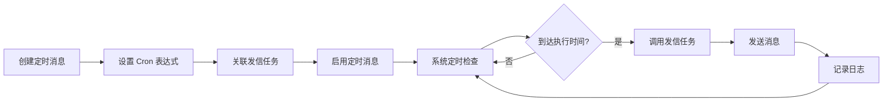

# 定时消息

定时消息功能允许您设置定时发送的消息任务，系统会按照设定的 Cron 表达式自动执行发送。

## 功能概述

定时消息允许您：
- ✅ 创建定时发送任务
- ✅ 使用 Cron 表达式设置执行时间
- ✅ 关联发信任务进行发送
- ✅ 启用/禁用定时任务
- ✅ 立即执行定时任务
- ✅ 查看执行日志

## 创建定时消息

### 步骤

1. 进入"定时消息"页面
2. 点击"新增定时消息"按钮
3. 填写定时消息信息
4. 点击"创建定时消息"保存

### 配置项

| 字段 | 说明 | 必填 |
|------|------|------|
| 定时消息名称 | 定时任务的名称 | 是 |
| 关联发信任务 | 选择要使用的发信任务 | 是 |
| Cron 表达式 | 定时执行的时间规则 | 是 |
| 标题 | 消息标题 | 是 |
| 内容 | 消息内容 | 是 |
| url | 可选的 URL 链接 | 否 |

::: warning 重要提示
请确保所选的发信任务已配置至少一个发送实例，否则无法发送消息。
:::

### Cron 表达式

Cron 表达式用于设置定时任务的执行时间，格式为：`分 时 日 月 周`

#### 常用模板

系统提供了常用的 Cron 表达式模板，点击即可应用：

| 模板 | Cron 表达式 | 说明 |
|------|------------|------|
| 每分钟 | `* * * * *` | 每分钟执行一次 |
| 每5分钟 | `*/5 * * * *` | 每5分钟执行一次 |
| 每小时 | `0 * * * *` | 每小时整点执行 |
| 每天凌晨2点 | `0 2 * * *` | 每天凌晨2点执行 |
| 每周一凌晨2点 | `0 2 * * 1` | 每周一凌晨2点执行 |
| 每月1号凌晨2点 | `0 2 1 * *` | 每月1号凌晨2点执行 |

#### Cron 表达式格式

```
* * * * *
│ │ │ │ │
│ │ │ │ └─ 星期 (0-7, 0和7都表示周日)
│ │ │ └─── 月份 (1-12)
│ │ └───── 日期 (1-31)
│ └─────── 小时 (0-23)
└───────── 分钟 (0-59)
```

#### 特殊字符

- `*` - 匹配任意值
- `,` - 列举多个值，如 `1,3,5`
- `-` - 范围，如 `1-5`
- `/` - 步长，如 `*/5` 表示每5个单位

#### 示例

```
0 9 * * *        # 每天上午9点
0 9-17 * * *     # 每天9点到17点的整点
0 9,12,18 * * *  # 每天9点、12点、18点
*/30 9-17 * * *  # 每天9点到17点，每30分钟
0 9 * * 1-5      # 周一到周五的上午9点
0 0 1,15 * *     # 每月1号和15号的凌晨
```

## 管理定时消息

### 查看定时消息列表

在"定时消息"页面可以看到所有定时消息：

| 列 | 说明 |
|----|------|
| ID | 定时消息的唯一标识 |
| 名称 | 定时消息名称（可点击查看完整内容） |
| 内容 | 消息内容（可点击查看完整内容） |
| Cron表达式 | 定时执行的时间规则 |
| 关联任务 | 关联的发信任务 ID |
| 下次执行时间 | 下一次计划执行的时间 |
| 创建时间 | 定时消息创建时间 |
| 操作 | 操作按钮和启用/禁用开关 |

### 定时消息操作

#### 查看日志

1. 点击定时消息的"日志"按钮
2. 查看该定时消息的执行记录
3. 可以查看发送成功/失败的详细信息

#### 编辑定时消息

1. 点击定时消息的"编辑"按钮
2. 在弹出的对话框中修改信息
3. 可以点击"立即发送"测试发送
4. 点击"更新定时消息"保存修改

#### 删除定时消息

1. 点击定时消息的"删除"按钮
2. 确认删除操作
3. 定时消息将被删除，不再执行

#### 启用/禁用定时消息

- 点击定时消息行的开关按钮
- 禁用的定时消息不会自动执行
- 可以随时重新启用

#### 立即发送

在编辑定时消息时，可以点击"立即发送"按钮立即执行一次发送，用于测试定时消息配置是否正确。

### 搜索定时消息

在定时消息列表页面的搜索框中输入任务名称，可以快速筛选定时消息。

## 使用场景

### 场景 1：每日报表推送

**需求：** 每天早上9点自动发送前一天的业务报表

**配置：**
- 定时消息名称：每日业务报表
- 关联发信任务：报表推送任务
- Cron 表达式：`0 9 * * *`
- 标题：每日业务报表
- 内容：前一天的业务数据统计

### 场景 2：周会提醒

**需求：** 每周一上午9点提醒团队周会

**配置：**
- 定时消息名称：周会提醒
- 关联发信任务：团队通知任务
- Cron 表达式：`0 9 * * 1`
- 标题：周会提醒
- 内容：今天上午10点周会，请准时参加

### 场景 3：系统巡检

**需求：** 每小时检查系统状态并发送报告

**配置：**
- 定时消息名称：系统巡检
- 关联发信任务：系统告警任务
- Cron 表达式：`0 * * * *`
- 标题：系统巡检报告
- 内容：系统运行正常

### 场景 4：月度账单

**需求：** 每月1号凌晨发送上月账单

**配置：**
- 定时消息名称：月度账单
- 关联发信任务：账单推送任务
- Cron 表达式：`0 2 1 * *`
- 标题：月度账单
- 内容：上月账单详情

## 工作流程



## 最佳实践

### 1. Cron 表达式设置

- ✅ 使用系统提供的常用模板
- ✅ 避免设置过于频繁的执行（如每分钟）
- ✅ 选择系统低峰期执行（如凌晨）
- ✅ 测试 Cron 表达式是否正确

### 2. 发信任务配置

- ✅ 确保关联的发信任务已配置实例
- ✅ 测试发信任务是否能正常发送
- ✅ 为重要消息配置多个渠道
- ✅ 使用有意义的任务名称

### 3. 消息内容

- ✅ 标题简洁明了
- ✅ 内容清晰完整
- ✅ 提供必要的链接（url 字段）
- ✅ 使用立即发送测试内容

### 4. 监控和维护

- ✅ 定期查看执行日志
- ✅ 及时处理发送失败的情况
- ✅ 禁用不再需要的定时消息
- ✅ 定期检查下次执行时间是否正确

### 5. 性能优化

- ✅ 避免在同一时间执行大量定时任务
- ✅ 合理设置执行频率
- ✅ 对于大量消息，考虑分批发送
- ✅ 监控系统资源使用情况

## 常见问题

### Q: 定时消息没有执行怎么办？

**A:** 
1. 检查定时消息是否已启用（开关是否打开）
2. 检查 Cron 表达式是否正确
3. 查看下次执行时间是否符合预期
4. 检查关联的发信任务是否配置了实例
5. 查看日志是否有错误信息

### Q: 如何测试定时消息配置是否正确？

**A:** 
1. 编辑定时消息
2. 点击"立即发送"按钮
3. 查看是否成功发送
4. 检查日志中的发送记录

### Q: Cron 表达式如何设置？

**A:** 
1. 使用系统提供的常用模板
2. 参考 Cron 表达式格式说明
3. 使用在线 Cron 表达式生成器
4. 通过立即发送测试是否正确

### Q: 定时消息发送失败怎么办？

**A:** 
1. 查看日志中的错误信息
2. 检查关联的发信任务配置
3. 确认发信任务的渠道是否正常
4. 检查消息内容是否符合要求
5. 尝试立即发送测试

### Q: 可以暂停定时消息吗？

**A:** 
可以。点击定时消息行的开关按钮禁用，定时消息将不再自动执行。需要时可以重新启用。

### Q: 定时消息和发信任务有什么关系？

**A:** 
定时消息需要关联一个发信任务，定时消息只负责定时触发，实际的消息发送由关联的发信任务完成。发信任务决定了消息发送到哪些渠道。

## 注意事项

::: warning 重要提示
1. **关联任务配置** - 确保关联的发信任务已配置至少一个发送实例
2. **Cron 表达式** - 设置前请仔细检查，避免执行时间错误
3. **执行频率** - 避免设置过于频繁的执行，影响系统性能
4. **消息内容** - 定时消息的内容是固定的，不支持动态内容
5. **启用状态** - 创建后记得启用定时消息，否则不会执行
:::

## 下一步

- 查看 [发送任务](/guide/tasks) 了解如何配置发信任务
- 查看 [V1 API 文档](/api/v1) 了解消息发送机制
- 查看 [渠道配置](/guide/channels) 了解如何配置推送渠道
