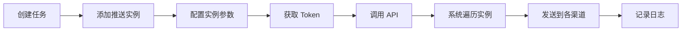

# 发送任务

发送任务是 Message Nest 的基础功能，用于配置消息发送的渠道和参数，通过 V1 API 发送消息。

::: tip 💡 推荐使用模板
对于新项目，我们推荐使用 [消息模板](/guide/template) 功能，它提供更好的内容管理和维护体验。发送任务主要用于兼容历史数据。
:::

## 功能概述

发送任务允许您：
- ✅ 创建发送任务
- ✅ 为任务添加推送渠道实例
- ✅ 配置每个实例的参数
- ✅ 获取 API Token 用于发送消息
- ✅ 查看任务的发送日志

## 创建任务

### 步骤

1. 进入"发送任务"页面
2. 点击"新增任务"按钮
3. 输入任务名称
4. 点击"保存"

### 配置项

| 字段 | 说明 | 必填 |
|------|------|------|
| 任务名称 | 任务的唯一标识名称 | 是 |

::: tip 提示
任务创建后，需要添加推送实例才能发送消息。
:::

## 添加推送实例

为任务添加一个或多个推送渠道实例。

### 步骤

1. 在任务列表中点击"编辑"按钮
2. 在搜索框中输入渠道名称
3. 从下拉列表中选择已创建的推送渠道
4. 配置实例参数（根据渠道类型不同）
5. 选择消息格式（Text/HTML/Markdown）
6. 点击"添加"保存实例

### 实例配置说明

不同渠道需要配置不同的参数：

#### 邮件渠道

- **固定模式**：
  - 收件人邮箱 - 接收邮件的邮箱地址
  - 消息格式 - Text 或 HTML
- **动态接收者模式（群发）** 🆕：
  - 勾选"动态接收者模式"
  - 无需配置固定收件人
  - 发送时通过 API 的 `recipients` 参数指定多个收件人
  - 适用于邮件群发场景

#### 钉钉/企业微信

- **消息格式** - Text 或 Markdown
- **@提醒** - 可选配置@手机号或@所有人

#### 微信公众号

- **固定模式**：
  - 用户 OpenID - 接收消息的用户标识
- **动态接收者模式（群发）** 🆕：
  - 勾选"动态接收者模式"
  - 无需配置固定 OpenID
  - 发送时通过 API 的 `recipients` 参数指定多个 OpenID
  - 适用于公众号群发场景

#### 自定义 Webhook

- 根据 Webhook 要求配置相应参数

#### 自托管消息

- 无需额外配置
- **消息格式** - Text、HTML 或 Markdown

::: warning 动态接收者模式限制
1. 一个任务只能配置一个动态接收实例
2. 动态接收实例不能与固定接收实例混合使用
3. 如果配置了动态接收实例，API 调用时 `recipients` 参数为必填
4. 建议控制接收者数量，避免触发渠道限流
:::

## 管理任务

### 查看任务列表

在"发送任务"页面可以看到所有任务：

| 列 | 说明 |
|----|------|
| ID | 任务的唯一标识 |
| 发信任务名称 | 任务名称 |
| 创建时间 | 任务创建时间 |
| 更新时间 | 任务最后修改时间 |
| 操作/状态 | 操作按钮 |

### 任务操作

#### 查看接口

1. 点击任务的"接口"按钮
2. 查看 API Token 和调用示例
3. 复制 Token 用于 V1 API 调用

#### 查看日志

1. 点击任务的"日志"按钮
2. 查看该任务的发送记录
3. 可以筛选和搜索日志

#### 编辑任务

1. 点击任务的"编辑"按钮
2. 在弹出的对话框中管理推送实例
3. 可以添加、删除、启用/禁用实例

#### 删除任务

1. 点击任务的"删除"按钮
2. 确认删除操作
3. 任务及其所有实例将被删除

::: warning 注意
删除任务后，该任务的 Token 将失效，无法再使用 V1 API 发送消息。
:::

### 管理推送实例

在编辑任务对话框中可以管理推送实例：

#### 查看实例列表

| 列 | 说明 |
|----|------|
| 渠道名称 | 推送渠道的名称 |
| 渠道类型 | 渠道类型（邮件、钉钉等） |
| 消息格式 | Text/HTML/Markdown |
| 状态 | 启用/禁用开关 |
| 操作 | 删除按钮 |

#### 启用/禁用实例

- 点击实例行的开关按钮
- 禁用的实例不会参与消息发送
- 可以随时重新启用

#### 删除实例

- 点击实例行的"删除"按钮
- 确认删除操作
- 实例将从任务中移除

### 搜索任务

在任务列表页面的搜索框中输入任务名称，可以快速筛选任务。

## 使用任务发送消息

### 通过 API 调用

使用 V1 API 发送消息，详见 [V1 API 文档](/api/v1)。

**基本示例：**

```bash
curl -X POST http://your-domain/api/v1/message/send \
  -H "Content-Type: application/json" \
  -d '{
    "token": "your_task_token",
    "title": "消息标题",
    "text": "消息内容"
  }'
```

### 多格式发送

可以同时提供多种格式，系统会根据实例配置自动选择：

```json
{
  "token": "your_task_token",
  "title": "订单通知",
  "text": "您的订单已发货",
  "html": "<h2>订单通知</h2><p>您的订单已发货</p>",
  "markdown": "## 订单通知\n\n您的订单已发货"
}
```

### @提醒功能

对于支持的渠道（钉钉、企业微信），可以使用@提醒：

```json
{
  "token": "your_task_token",
  "title": "系统告警",
  "text": "服务器CPU使用率过高",
  "at_mobiles": ["13800138000"],
  "at_all": false
}
```

### 动态接收者功能（群发）🆕

对于支持的渠道（邮件、微信公众号），可以使用动态接收者实现群发：

```json
{
  "token": "your_task_token",
  "title": "系统维护通知",
  "text": "系统将于今晚22:00进行维护",
  "html": "<h2>系统维护通知</h2><p>系统将于今晚<strong>22:00</strong>进行维护</p>",
  "recipients": [
    "user1@example.com",
    "user2@example.com",
    "user3@example.com"
  ]
}
```

**使用场景：**
- 邮件群发通知
- 微信公众号批量推送
- 营销活动通知
- 系统公告发布

**注意事项：**
- 任务必须配置为动态接收者模式
- 一个任务只能有一个动态接收实例
- 建议控制接收者数量，避免触发限流

## 工作流程



## 使用场景

### 场景 1：多渠道通知

创建一个任务，配置多个推送实例（邮件 + 钉钉 + 企业微信），一次 API 调用同时推送到所有渠道。

**适用于：**
- 重要系统告警
- 关键业务通知
- 需要多渠道触达的消息

### 场景 2：不同环境隔离

为开发、测试、生产环境创建不同的任务，使用不同的渠道配置。

**适用于：**
- 环境隔离
- 测试验证
- 灰度发布

### 场景 3：按用途分类

为不同用途创建不同的任务（如：用户通知、系统告警、营销推广），便于管理和统计。

**适用于：**
- 消息分类管理
- 统计分析
- 权限控制

## 最佳实践

### 1. 任务命名

使用清晰的命名规范：
- ✅ `生产-用户通知-邮件钉钉`
- ✅ `测试-系统告警-企业微信`
- ❌ `任务1`、`test`

### 2. 实例配置

- **合理选择渠道** - 根据消息重要性和紧急程度选择合适的渠道
- **配置备用渠道** - 为重要消息配置多个渠道，提高送达率
- **格式适配** - 为不同渠道提供合适的消息格式

### 3. Token 管理

- **安全存储** - 不要在代码中硬编码 Token，使用环境变量或配置文件
- **定期轮换** - 定期更新 Token，提高安全性
- **权限控制** - 不同环境使用不同的 Token

### 4. 日志监控

- **定期查看** - 定期检查发送日志，及时发现问题
- **失败处理** - 对发送失败的消息进行重试或告警
- **统计分析** - 分析发送数据，优化渠道配置

### 5. 性能优化

- **异步调用** - 使用异步方式调用 API，避免阻塞主流程
- **批量发送** - 对于大量消息，考虑批量发送或限流
- **错误重试** - 实现合理的重试机制

## 常见问题

### Q: 任务和模板有什么区别？

**A:** 
- **任务（V1 API）**：内容在 API 调用时传递，适合完全动态的内容
- **模板（V2 API）**：内容预定义在模板中，通过占位符替换，推荐使用

详见 [V1 API 文档](/api/v1) 中的对比说明。

### Q: 可以为一个任务配置多个实例吗？

**A:** 可以。一个任务可以配置多个推送实例，API 调用时会自动遍历所有启用的实例进行发送。

### Q: 如何知道消息是否发送成功？

**A:** 
1. API 响应会返回发送状态
2. 在任务的日志页面查看详细的发送记录
3. 可以配置自托管消息渠道，在后台查看消息

### Q: Token 泄露了怎么办？

**A:** 
1. 立即删除该任务（Token 将失效）
2. 创建新的任务获取新的 Token
3. 更新使用该 Token 的所有代码

### Q: 发送失败如何处理？

**A:** 
1. 查看日志中的错误信息
2. 检查渠道配置是否正确
3. 确认渠道服务是否正常
4. 检查消息内容是否符合渠道要求
5. 实现重试机制

## 迁移到模板

如果您正在使用发送任务，我们建议迁移到消息模板：

### 迁移步骤

1. **创建模板**
   - 根据现有任务的消息内容创建模板
   - 定义占位符替换动态内容

2. **配置实例**
   - 将任务的推送实例配置复制到模板

3. **更新代码**
   - 将 V1 API 调用改为 V2 API
   - 使用模板 Token 和占位符参数

4. **测试验证**
   - 测试新的模板发送是否正常
   - 对比新旧方式的效果

5. **切换上线**
   - 逐步切换到模板方式
   - 保留旧任务一段时间作为备用

### 迁移优势

- ✅ 内容统一管理，便于维护
- ✅ 修改内容无需改代码
- ✅ 支持版本控制和灰度发布
- ✅ 更好的团队协作体验

## 下一步

- 查看 [推送渠道配置](/guide/channels) 了解如何配置渠道
- 查看 [消息模板](/guide/template) 了解推荐的使用方式
- 查看 [V1 API 文档](/api/v1) 了解 API 调用方法
